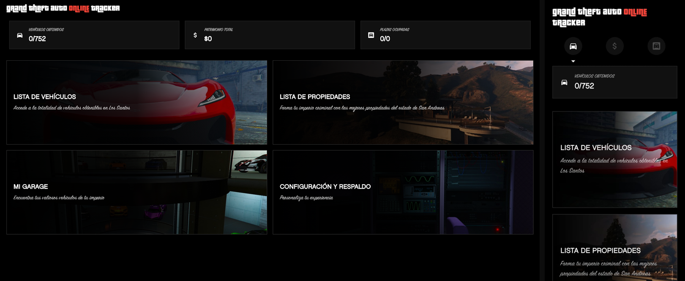
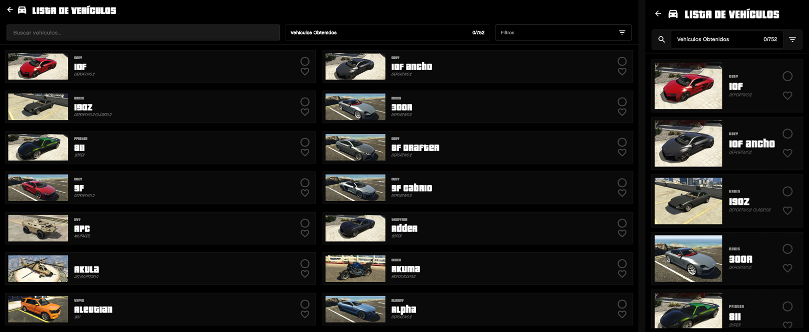
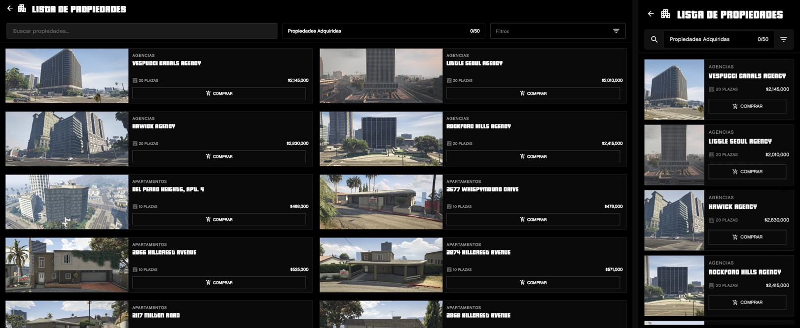
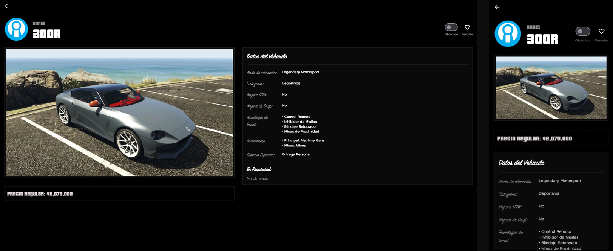
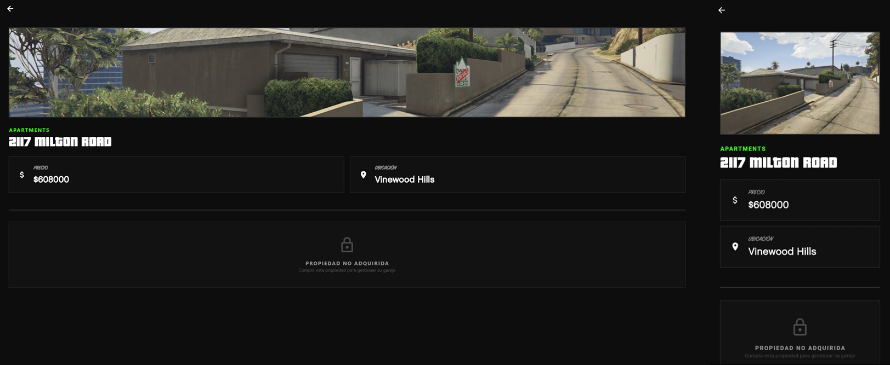

# GTA Online Car Tracker v1.0

La herramienta definitiva hecha para los coleccionistas de GTA Online. Gestiona tus propiedades y vehículos con una interfaz moderna y acogedora.

## Características Principales
* **✨ Importación por IA:** Pega un texto generado por IA y la app importará tus vehículos automáticamente.
* **🏠 Gestión de Propiedades:** Soporte para apartamentos, hangares, búnkeres y más.
* **🔍 Buscador Inteligente:** Encuentra cualquier vehículo en segundos.
* **📱 Diseño Responsive:** Optimizado para cualquier dispositivo Android.

## Screenshots
| Inicio | Vehiculos | Propiedades | Detalles del Vehículo | Detalles de la Propiedad |
| :---: | :---: | :---: | :---: | :---: |
|  |  |  |  |  |

## Descargas e Instalación

Puedes encontrar los ejecutables para todas las plataformas en la sección de [**Releases**](https://github.com/DevS4nsan/GTAOnlineTracker/releases).

### 🪟 Windows
1. Descarga el archivo `.zip` para Windows.
2. Extrae el contenido y ejecuta `gtaonlinetracker.exe`.
   *(Nota: Es posible que Windows SmartScreen dé un aviso al ser un desarrollador independiente).*

### 🐧 Linux
1. Descarga el binario para Linux.
2. Dale permisos de ejecución: `chmod +x gtaonlinetracker`.
3. ¡Ejecuta y listo!

### 📱 Android
1. Descarga el `app-release.apk`.
2. Permite la instalación de fuentes desconocidas en tu dispositivo.

---

## Créditos y Atribuciones

### Fotografía de Propiedades
Todas las imágenes de propiedades (apartamentos, garajes, hangares, etc.) incluidas en esta aplicación han sido capturadas y editadas originalmente por **[DevSansan](https://github.com/DevS4nsan)**.

> **Aviso de Uso:** Si deseas utilizar estos recursos visuales en tu propio proyecto, se requiere la atribución directa a este repositorio y a su autor original.

### Descargo de Responsabilidad (Legal)
* **Rockstar Games:** Los nombres de los vehículos, marcas ficticias, diseños de edificios y el universo de GTA Online son propiedad intelectual de **Rockstar Games** y **Take-Two Interactive**. Esta es una aplicación hecha por fans para fans, sin fines de lucro y no está afiliada, patrocinada ni respaldada por Rockstar Games.
* **Iconografía:** Los logos de marcas de vehículos son propiedad de sus respectivos dueños originales dentro del juego.

---

## Financia el próximo golpe
Si este tracker te ha ayudado a organizar tu imperio criminal en San Andreas, y quieres apoyar el desarrollo de futuras funciones (como la v1.1 con imágenes WebP optimizadas, soporte para multiples idioma), puedes invitarme a un café. ¡Cualquier ayuda es muy apreciada!

*(Todas las donaciones se destinarán a mantener el proyecto y mejorar la base de datos de vehículos).*

---
Hecho con ❤️ por [DevSansan](https://github.com/DevS4nsan)